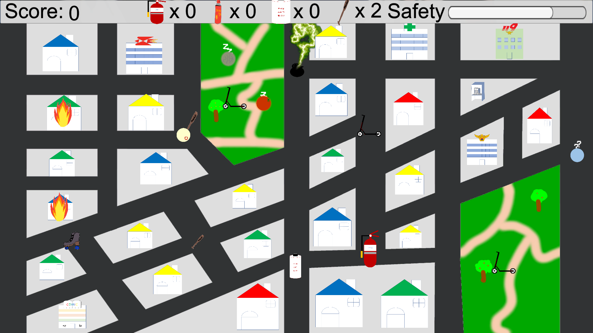

# 취미로 히어로

### 게임제작동아리 '판도라 큐브' 겨울방학 자체 게임잼

## 개요
3일동안 주어진 주제와 관련된 게임을 제작해보자!

게임 잼의 주제 : 'Home'

게임 잼의 주제를 고려하여 'Home'을 다양한 위험으로부터 지켜야 하는 존재라고 의미 부여를 하여 플레이어가 마을의 'Home' 그리고 그 'Home'에 거주하는 'Resident'를 지키며 문제를 해결하는 게임입니다.

플레이어는 마을을 지키는 자칭 '영웅'입니다. 플레이어는 맵(화면 전체) 상에서 이동하면서 갖가지 문제 상황을 해결하며 점수를 획득합니다. 맵 곳곳에서 생성되는 아이템을 이용하여 마을을 오랫동안 지켜보세요!

## 팀원
* 프로그래밍파트 정회원 허유성
* 프로그래밍파트 정회원 이정민
* 프로그래밍파트 수습회원 이명석

## 개발 언어 및 환경
* C#
* Unity
* Visual studio
* 그림판 & PhotoShop

## 담당
* 허유성 : 도둑, 스토커, 주기적으로 주택에 불이 나는 이벤트 구현, 소화기, 투척용 소화기, 야구방망이. 호신용 스프레이, 성경 등 불을 끄거나 나쁜 NPC를 물리칠 수 있는 아이템 구현, 사운드 편집 및 삽입
* 이정민 : 맵 제작, 미아 이벤트, 노숙자 이벤트, 게임 내 직접적인 방해 요소 구현(비행기 및 미세먼지로 인한 시야 축소 등)
* 이명석 : 게임 그래픽 리소스 제작, 스케이트 및 킥보드 아이템 구현

## 새로운 시도
* Ray를 이용한 원거리 소화기 아이템 구현
* 애니메이터를 이용하여 배트를 휘두르는 모션 구현
* 코루틴을 이용하여 도둑에게만 번개가 떨어지게 하는 성경책 아이템 구현

## 게임 플레이 화면

* 성경책 아이템을 먹은 후, 1초가 지나면 도둑에게 번개가 떨어짐

